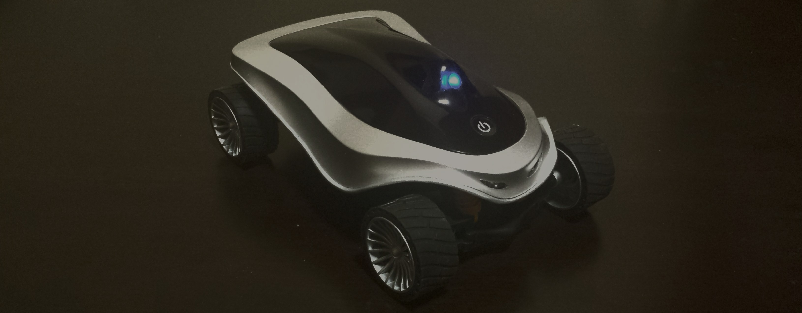

# Introduction

In this document we report the results of a project for the [Udacity](https://www.udacity.com/)
[Self-Driving Car Engineer](https://www.udacity.com/drive?utm_source%3Dgoogle&utm_medium%3Dcpc&utm_campaign%3Dbrand&gclid%3DCOuc4pLi0dECFUtNfgodvSAPcg) Nanodegree program's first semester.  The
objective of the project is to build and train a model capable of
driving a simulated car.

The method is quite simple.  We somehow acquire training
data&#x2014;perhaps by recording it ourselves&#x2014;in a computerized driving
simulator.  The training data comprise images of the road as seen
from cameras mounted on the simulated car, along with corresponding
control inputs (in this case, just the steering angle).  The
training data are used to train a [Deep Learning](https://en.wikipedia.org/wiki/Deep_learning) [neural network](https://en.wikipedia.org/wiki/Artificial_neural_network) model
so that it recognizes road/car configurations and generates the
appropriate steering angle.  The model is then used to generate
inputs (steering angles) in real-time for the simulation, unpiloted
by a human driver.

Here is a brief enumeration of the elements of my project
laboratory.

-   [Keras](https://keras.io/) - Deep Learning toolkit for Python
-   [TensorFlow](https://www.tensorflow.org/) - High-Performance numerical computation library for
    Python and backend for Keras.
-   Unix [command-line tools](https://en.wikipedia.org/wiki/GNU_Core_Utilities) - handy for data pre-processing
-   [Emacs](https://www.gnu.org/software/emacs/) - indispensable coding and writing environment
-   [Org mode](http://orgmode.org/) - indispensable writing and publishing environment for
    Emacs
-   [Lenovo IdeaPad U310](http://shop.lenovo.com/us/en/laptops/ideapad/u-series/u310/) - somewhat ancient laptop
-   [The Mechanic's Institute Library](https://www.milibrary.org/) - a calm oasis in downtown San
    Francisco (shown below)

While tools like Keras and TensorFlow (really, TensorFlow) are
tailor-made for modern high-performance parallel numerical
computation using [GPUs](https://en.wikipedia.org/wiki/Graphics_processing_unit), environments that are easily-obtained with
cloud-computing environments like [Amazon AWS](https://aws.amazon.com/s/dm/optimization/server-side-test/sem-generic/free-b/?sc_channel%3DPS&sc_campaign%3Dacquisition_US&sc_publisher%3Dgoogle&sc_medium%3Dcloud_computing_hv_b&sc_content%3Daws_core_e_test_q32016&sc_detail%3Damazon%2520-%2520aws&sc_category%3Dcloud_computing&sc_segment%3D102882732282&sc_matchtype%3De&sc_country%3DUS&s_kwcid%3DAL!4422!3!102882732282!e!!g!!amazon%2520-%2520aws&ef_id%3DWHrLLwAABAl9uhYF:20170120011018:s), everything in this
experiment was conducted just on this one laptop.  While better
hardware would be almost certainly be essential for real Deep
Learning applications and autonomous vehicles, in this toy problem
it wasn't really necessary.

Also, note that everything in this project was done in this
document's corresponding [README.org](README.md) Org-Mode file in Emacs.  This
file does not merely document the code.  This document *is* the
code.  Like [Jupyter](http://jupyter.org/) notebooks, it is an example of
[literate
programming](https://en.wikipedia.org/wiki/Literate_programming), and the [model.py](model.py) file is *generated* from this
document.

# Methods

## Data

### Collection and Preparation

Behavioral cloning relies on training neural networks with data
exhibiting the very behavior you wish to clone.  One way to
achieve that for this project is to use a driving simulator
provided by Udacity, which in its "training mode" can emit a
stream of data samples as the user operates the car.  Each
sample consists of a triplet of images and a single floating
point number in the interval [-1, 1], recording the view and the
steering angle for the simulation and car at regular intervals.
The three images are meant to be from three "cameras" mounted on
the simulated car's left, center, and right, giving three
different aspects of the scene and in principle providing
stereoscopic depth information.

The driving simulator also has an "autonomous mode" in which the
car interacts with a network server to exchange telemetry that
guides the car.  The simulator sends the network server camera
images and the network server is expected to reply with steering
angles.  So, not only is the driving simulator critical for
understanding the problem and helpful for obtaining training
data, it is absolutely essential for evaluating the solution.

Actually, Udacity provides not [one](https://d17h27t6h515a5.cloudfront.net/topher/2016/November/5831f0f7_simulator-linux/simulator-linux.zip) but [two](https://d17h27t6h515a5.cloudfront.net/topher/2017/January/587527cb_udacity-sdc-udacity-self-driving-car-simulator-dominique-development-linux-desktop-64-bit-5/udacity-sdc-udacity-self-driving-car-simulator-dominique-development-linux-desktop-64-bit-5.zip) simulators.  The
first is the stock simulator and the second is an enhanced
simulator, whose ability to use a computer mouse as input is
very important for acquiring good training data with smoothly
varying steering angles.  So, why not get both?  Here, we
download and unzip the Linux versions into sub-directories
`simulator-linux` and `simulator-beta`.

    wget -O simulator-linux.zip "https://d17h27t6h515a5.cloudfront.net/topher/2016/November/5831f0f7_simulator-linux/simulator-linux.zip"
    wget -O simulator-beta.zip "https://d17h27t6h515a5.cloudfront.net/topher/2017/January/587527cb_udacity-sdc-udacity-self-driving-car-simulator-dominique-development-linux-desktop-64-bit-5/udacity-sdc-udacity-self-driving-car-simulator-dominique-development-linux-desktop-64-bit-5.zip"
    unzip -d simulator-linux -u simulator-linux.zip > /dev/null 2>&1
    unzip -d simulator-beta -u simulator-beta.zip > /dev/null 2>&1

While we are at it, we might as well get the network server as
well, which is implemented in the [drive.py](https://d17h27t6h515a5.cloudfront.net/topher/2017/January/586c4a66_drive/drive.py) Python file.

    wget https://d17h27t6h515a5.cloudfront.net/topher/2017/January/586c4a66_drive/drive.py

Now, while we are encouraged to collect our own training data,
it turns out that Udacity supplies their own training data for
the first of the two tracks, which is the track on which the
solution will be validated.  We might as well get that as well,
and see how much progress we can make just with the provided
samples.  The data are in a zip file, [data.zip](https://d17h27t6h515a5.cloudfront.net/topher/2016/December/584f6edd_data/data.zip), which we of
course unzip, taking care to remove the annoying `__MACOSX`
directory.

    wget -nc "https://d17h27t6h515a5.cloudfront.net/topher/2016/December/584f6edd_data/data.zip"
    unzip data.zip > /dev/null 2>&1
    rm -rf __MACOSX

The data&#x2014;whether recorded or downloaded&#x2014;are presented as a
[CSV](https://en.wikipedia.org/wiki/Comma-separated_values) "index file", `driving_log.csv`.  Each line in this file
correlates images with the steering angle, throttle, brake, and
speed of the car.  The images are related via filenames in the
first three fields, which refer to the center, left, and right
camera images stored in files in the `IMG` subdirectory.  We can
take a look at the beginning of that file and then determine how
many samples are provided.

    head data/driving_log.csv
    wc -l data/driving_log.csv

    center,left,right,steering,throttle,brake,speed
    IMG/center_2016_12_01_13_30_48_287.jpg, IMG/left_2016_12_01_13_30_48_287.jpg, IMG/right_2016_12_01_13_30_48_287.jpg, 0, 0, 0, 22.14829
    IMG/center_2016_12_01_13_30_48_404.jpg, IMG/left_2016_12_01_13_30_48_404.jpg, IMG/right_2016_12_01_13_30_48_404.jpg, 0, 0, 0, 21.87963
    IMG/center_2016_12_01_13_31_12_937.jpg, IMG/left_2016_12_01_13_31_12_937.jpg, IMG/right_2016_12_01_13_31_12_937.jpg, 0, 0, 0, 1.453011
    IMG/center_2016_12_01_13_31_13_037.jpg, IMG/left_2016_12_01_13_31_13_037.jpg, IMG/right_2016_12_01_13_31_13_037.jpg, 0, 0, 0, 1.438419
    IMG/center_2016_12_01_13_31_13_177.jpg, IMG/left_2016_12_01_13_31_13_177.jpg, IMG/right_2016_12_01_13_31_13_177.jpg, 0, 0, 0, 1.418236
    IMG/center_2016_12_01_13_31_13_279.jpg, IMG/left_2016_12_01_13_31_13_279.jpg, IMG/right_2016_12_01_13_31_13_279.jpg, 0, 0, 0, 1.403993
    IMG/center_2016_12_01_13_31_13_381.jpg, IMG/left_2016_12_01_13_31_13_381.jpg, IMG/right_2016_12_01_13_31_13_381.jpg, 0, 0, 0, 1.389892
    IMG/center_2016_12_01_13_31_13_482.jpg, IMG/left_2016_12_01_13_31_13_482.jpg, IMG/right_2016_12_01_13_31_13_482.jpg, 0, 0, 0, 1.375934
    IMG/center_2016_12_01_13_31_13_584.jpg, IMG/left_2016_12_01_13_31_13_584.jpg, IMG/right_2016_12_01_13_31_13_584.jpg, 0, 0, 0, 1.362115
    8037 data/driving_log.csv

We have 8037 lines, but descriptive labels are provided in the
first line of this file.  We strip that line out.  Also, Deep
Learning lore says that it is often prudent to randomize the
data when possible and always prudent to split the data into
training and validation sets.  Here we do all three in just a
few lines of shell code, taking 1000 samples (about 12%) as
validation data.

    cat data/driving_log.csv | tail -n+2 | shuf > data/driving_log_all.csv
    cat data/driving_log_all.csv | head -n1000 > data/driving_log_validation.csv
    cat data/driving_log_all.csv | tail -n+1001 > data/driving_log_train.csv

As a sanity check, we report the number of total samples,
training samples, and validation samples.  Even if the provided
Udacity data are insufficient ultimately for delivering a
solution, they are valuable for establishing a baseline for
developing that solution.  A project like this has many free
parameters and the combinatorial explosion among them can
quickly overwhelm the researcher, and so eliminating some of
those free parameters by avoiding recording one's own data&#x2014;if
only in the interim&#x2014;is a real boon.  We do not use the
[`driving_log_all.csv`](data/driving_log_all.csv) file after this point; it served as a
handy placeholder of the original data, shuffled and with the
header removed.  However, the [`driving_log_train.csv`](data/driving_log_train.csv) and
[`driving_log_validation.csv`](data/driving_log_validation.csv) files play a central role as we
iteratively develop and refine the model.

    wc -l data/driving_log_all.csv
    wc -l data/driving_log_train.csv
    wc -l data/driving_log_validation.csv

    8036 data/driving_log_all.csv
    7036 data/driving_log_train.csv
    1000 data/driving_log_validation.csv

Before leaving the land of shell commands for the land of Python
scripts and neural nets, we create one other useful data file.
Paul Heraty [argues](https://carnd-forums.udacity.com/questions/26214464/behavioral-cloning-cheatsheet) that it can be useful in the early stages of
developing a solution to "overtrain" it on a small sample
comprising disparate canonical examples.  As we shall see, we
can confirm that this was *extremely* good advice.

One of the chief difficulties we encountered as a newcomer to Deep
Learning and its community of tools was simply "getting it to
work in the first place," independent of whether the model
actually was very good.  One of the chief strategies for
overcoming this difficulty we found is to "try to get a pulse:"
develop the basic machinery of the model and solution first,
with little or no regard for its fidelity.  Working through the
inevitable blizzard of error messages one first encounters is no
small task.  Once it is cleared and the practitioner has
confidence his tools are working well, then it becomes possible
to rapidly iterate and converge to a *good* solution.  

Creating an "overtraining sample" is good because overtraining
is a vivid expectation that can quickly be realized (especially
with only 3 samples), and if overtraining does not occur you
know you have deeper problems.

With a little magic from [Bash](https://www.gnu.org/software/bash/manual/), [Awk](https://www.gnu.org/software/gawk/manual/gawk.html), etc., we can select three
disparate samples, with neutral steering, extreme left steering,
and extreme right steering.

    cat <(cat data/driving_log_all.csv | sort -k4 -n -t, | head -n1) <(cat data/driving_log_all.csv | sort -k4 -nr -t, | head -n1) <(cat data/driving_log_all.csv | awk -F, -vOFS=, '{print $1, $2, $3, sqrt($4*$4), $5, $6, $7}' | sort -k4 -n -t, | head -n1) > data/driving_log_overtrain.csv
    cat data/driving_log_overtrain.csv

    IMG/center_2016_12_01_13_39_28_024.jpg, IMG/left_2016_12_01_13_39_28_024.jpg, IMG/right_2016_12_01_13_39_28_024.jpg, -0.9426954, 0, 0, 28.11522
    IMG/center_2016_12_01_13_38_46_752.jpg, IMG/left_2016_12_01_13_38_46_752.jpg, IMG/right_2016_12_01_13_38_46_752.jpg, 1, 0, 0, 13.2427
    IMG/center_2016_12_01_13_30_48_287.jpg, IMG/left_2016_12_01_13_30_48_287.jpg, IMG/right_2016_12_01_13_30_48_287.jpg,0, 0, 0, 22.14829

We will be able to see exactly what the images for these samples
once we set up a suitable Python environment, which we do in the
next section.

### Setup

Udacity helpfully provides a [CarND Starter Kit](https://classroom.udacity.com/nanodegrees/nd013/parts/fbf77062-5703-404e-b60c-95b78b2f3f9e/modules/83ec35ee-1e02-48a5-bdb7-d244bd47c2dc/lessons/8c82408b-a217-4d09-b81d-1bda4c6380ef/concepts/4f1870e0-3849-43e4-b670-12e6f2d4b7a7) in the contents
of a particular [GitHub repository](https://github.com/udacity/CarND-Term1-Starter-Kit/blob/master/README.md).  The instructions there lead
one to create a [Conda](http://conda.pydata.org/docs/) environment for Python.  We did that and
extracted its definition into the [environment.yml](environment.yml) file.  That
way, if the environment does not already exist it can be created
and activated with these commands.

    conda env create --file environment.yml --name CarND-Behavioral-Cloning
    source activate CarND-Behavioral-Cloning

Having set up the Conda environment, and activated it, now we
can finally load the Python modules that we will need in later
sections.

    from PIL import Image
    from itertools import groupby, islice, zip_longest, cycle, filterfalse
    from keras.layers import Conv2D, Flatten, MaxPooling2D, Dense, Dropout, Lambda, AveragePooling2D
    from keras.layers.convolutional import Cropping2D, Convolution2D
    from keras.models import Sequential, model_from_json
    from keras.utils.visualize_util import plot
    from scipy.stats import kurtosis, skew, describe
    import matplotlib.pyplot as plt
    import numpy as np
    import pprint as pp
    import random

### Utilities

Another piece of advice impressed upon students in the class, to
the point of it practically being a requirement, was to learn to
use Python [generators](https://wiki.python.org/moin/Generators) and the [`fit_generator`](https://keras.io/models/sequential/) function in our
Deep Learning toolkit, [Keras](https://keras.io/).  Generators allow for a form of
[lazy loading](https://en.wikipedia.org/wiki/Lazy_loading), which can be useful in Machine Learning settings
where large data sets that do not fit into main memory are the
norm.  Keras makes use of that with `fit_generator`, which
expects input presented as generators that infinitely recycle
over the underlying data.

I took that advice to heart and spent considerable
time&#x2014;perhaps more than was necessary&#x2014;learning about
generators and generator expressions.  It did pay off somewhat
in that I developed a tiny library of reusable, composeable
generator expressions, which are presented here.

Before doing that, though, first a detour and a bit of advice.
Anyone who is working with Python generators is urged to become
acquainted with [`itertools`](https://docs.python.org/3/library/itertools.html), a standard Python library of
reusable, composeable generators.  For me the [`cycle`](https://docs.python.org/3/library/itertools.html#itertools.cycle) generator
was a key find.  As mentioned above, `fit_generator` needs
infinitely-recycling generators, which is exactly what
`itertools.cycle` provides.  One wrinkle is that `cycle`
accomplishes this with an internal data cache, so if your data
do *not* fit in memory you may have to seek an alternative.
However, if your data *do* fit in memory this confers a very
nice property, for free: after cycling through the data the
first time all subsequent retrievals are from memory, so that
performance improves dramatically after the first cycle.

This turns out to be very beneficial and entirely appropriate
for our problem.  Suppose we use the Udacity data.  In that
case, we have 8136 images (training + validation) provided we
use one camera only (such as the center camera).  As we shall
see below, each image is a 320x160 pixel array of RGB values,
for a total of 150k per image.  That means approximately 1 GB of
RAM is required to store the Udacity data.  My 4 year-old laptop
has 4 times that.  Now, this rosy picture might quickly dissolve
if we use much more data, such as by using the other camera
angles and/or acquiring more training data.  Then again, it may
not.  With virtual memory, excess pages *should* be swapped out
to disk.  That's not ideal, but to first order it's not obvious
that it's functionally much different from or much worse than
recycling the data by repeatedly loading the raw image files.
In fact, it may be better, since at least we only perform the
actual translation from PNG format to [NumPy](http://www.numpy.org/) data arrays once for
each image.

If we are really concerned about memory usage we might consider
reducing the input image size, such as with OpenCV's
[`cv2.resize`](http://docs.opencv.org/2.4/modules/imgproc/doc/geometric_transformations.html#resize) command, and we might consider cropping the image.
But, I think we should think carefully about this.  These
operations may have an effect on the performance of the model,
and so manipulating the images in this way is not something we
should take lightly.  Nevertheless, it can be beneficial as we
shall see shortly.  However, if we *do* decide to crop and
resize, there is a technical trade-off to be made.  Either we
can crop and resize as a pre-processing step, or we can do it
directly within the model, and there are advantages and
disadvantages to each.  If we crop and resize as a
pre-processing step, it has direct impact on the aforementioned
memory considerations.  But, we *must take care to perform exactly the same crop and resize operations in the network server!*  Since cropping and resizing essentially introduce new
hyper-parameters, those parameters somehow must be communicated
to `drive.py`.  If we crop and resize directly within the model,
it has no beneficial impact on the aforementioned memory
considerations.  But, *we get those operations and their internal hyper-parameters for free within the network server!*  I found
the latter advantage to be much greater and so the trade-off I
selected was to crop and resize within the model.

In any case, my experiments showed that for the Udacity data at
least, loading the data into an in-memory cache via
`itertools.cycle` (or, more precisely, my variation of it) and
then infinitely recycling over them proved to be a very good
solution.

However, there is one problem with `itertools.cycle` by itself,
and that is that again, according to Deep Learning lore, it is
prudent to randomize the data on every epoch.  To do that, we
need to rewrite `itertools.cycle` so that it shuffles the data
upon every recycle.  That is easily done, as shown below.  Note
that the elements of the iterable are essentially returned in
batches, and that the first batch is not shuffled.  If you want
only to return random elements then you must know the batch
size, which will be the number of elements in the underlying
finite iterable, and you must discard the first batch.  The
itertools.islice function can be helpful here.  In our case it
is not a problem since all of the data were already shuffled
once using Unix command-line utilities above.

    def rcycle(iterable):
        saved = []                 # In-memory cache
        for element in iterable:
            yield element
            saved.append(element)
        while saved:
            random.shuffle(saved)  # Shuffle every batch
            for element in saved:
                  yield element

If we invoke `rcycle` on a sequence drawn from the interval
[0,5), taken in 3 batches for a total of 15 values we can see
this behavior.  The first 5 values are drawn in order, but then
the next 10 are drawn in two batches, each batch shuffled
independently.  In practice, this is not a problem.

    [x for x in islice(rcycle(range(5)), 15)]

    [0, 1, 2, 3, 4, 1, 3, 4, 2, 0, 3, 1, 4, 0, 2]

The remaining utility functions that I wrote are quite
straightforward and for brevity are written as "one-liners."

-   **feed:** generator that feeds lines from the file named by 'filename'
-   **split:** generator that splits lines into tuples based on a delimiter
-   **select:** generator that selects out elements from tuples
-   **load:** non-generator that reads an image file into a NumPy array
-   **Xflip:** non-generator that flips an input image horizontally
-   **yflip:** non-generator that flips a target label to its negative
-   **rmap:** generator that randomly applies or does not apply a
    function with equal probability
-   **rflip:** generator that flips samples 50% of the time
-   **fetch:** generator that loads index file entries into samples
-   **group:** generator that groups input elements into lists
-   **transpose:** generator that takes a generator of lists into a
    list of generators
-   **batch:** generator that takes a list of generators into a list
    of NumPy array "batches"

    feed = lambda filename: (l for l in open(filename))
    split = lambda lines, delimiter=",": (line.split(delimiter) for line in lines)
    select = lambda fields, indices: ([r[i] for i in indices] for r in fields)
    load = lambda f: np.asarray(Image.open(f))
    Xflip = lambda x: x[:,::-1,:]
    yflip = lambda x: -x
    sflip = lambda s: (Xflip(s[0]), yflip(s[1]))
    rmap = lambda f,g: (x if random.choice([True, False]) else f(x) for x in g)
    rflip = lambda s: rmap(sflip, s)
    fetch = lambda records, base: ([load(base+f.strip()) for f in record[:1]]+[float(v) for v in record[1:]] for record in records)
    group = lambda items, n, fillvalue=None: zip_longest(*([iter(items)]*n), fillvalue=fillvalue)
    transpose = lambda tuples: (list(map(list, zip(*g))) for g in tuples)
    batch = lambda groups, indices=[0, 1]: ([np.asarray(t[i]) for i in indices] for t in groups)

### Exploratory Analysis

It often pays to explore your data with relatively few
constraints before diving in to build and train the actual
model.  One may gain insights that help guide you to better
models and strategies, and avoid pitfalls and dead-ends.  

To that end, first we just want to see what kind of input data
we are dealing with.  We know that they are RGB images, so let's
load a few of them for display.  Here, we show the three frames
taken from the `driving_log_overtrain.csv` file described
above&#x2014;center camera only&#x2014;labeled by their corresponding
steering angles.  As you can see, the image with a large
negative angle seems to have the car on the extreme right edge
of the road.  Perhaps the driver in this situation was executing
a "recovery" maneuver, turning sharply to the left to veer away
from the road's right edge and back to the centerline.
Likewise, with the next figure that has a large positive angle,
we see that the car appears to be on the extreme left edge of
the road.  Perhaps the opposite recovery maneuver was in play.
Finally, in the third and last image that has a neutral steering
angle (0.0), the car appears to be sailing right down the middle
of the road, a circumstance that absent extraneous circumstances
(other cars, people, rodents) should not require corrective
steering.

    X = [x for x in fetch(select(split(feed("data/driving_log_overtrain.csv")), [0,3]), "data/")]
    f = plt.figure()                        # start a figure
    plt.imshow(X[0][0])                     # show the image
    f.suptitle("Angle: " + str(X[0][1]))    # add figure title
    s = plt.savefig("road1.png", format="png", bbox_inches='tight')
    f = plt.figure()
    plt.imshow(X[1][0])
    f.suptitle("Angle: " + str(X[1][1]))
    s = plt.savefig("road2.png", format="png", bbox_inches='tight')
    f = plt.figure()
    plt.imshow(X[2][0])
    f.suptitle("Angle: " + str(X[2][1]))
    s = plt.savefig("road3.png", format="png", bbox_inches='tight')

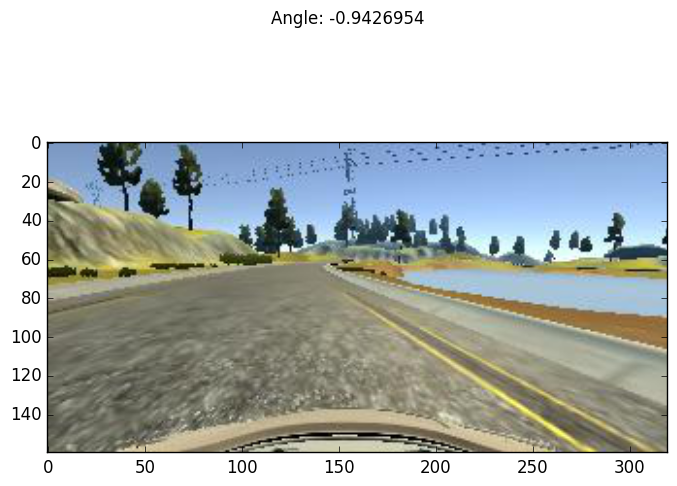

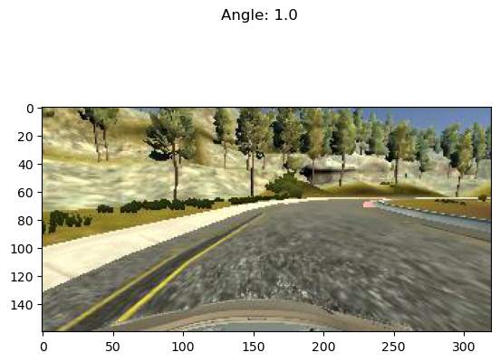

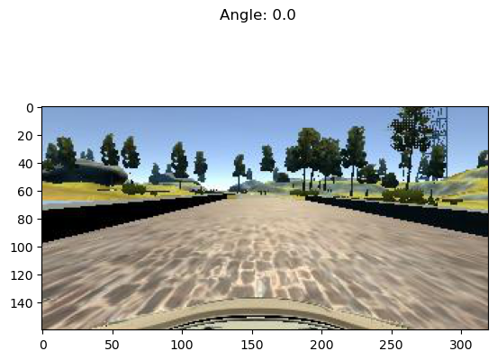

Next, we get the shape of an image which, as we said above, is
320x160x3.  In NumPy parlance that's `(160, 320, 3)`, for 160
rows (the y direction), 320 columns (the x direction), and 3
channels (the RGB colorspace).

    print(X[0][0].shape)  # X[0] is an (image,angle) sample. X[0][0] is just the image

    (160, 320, 3)

We can see that the images naturally divide roughly into "road"
below the horizon and "sky" above the horizon, with background
scenery (trees, mountains, etc.) superimposed onto the sky.
While the sky (really, the scenery) might contain useful
navigational information, it is plausible that it contains
little or no useful information for the simpler task of
maintaining an autonomous vehicle near the centerline of a
track, a subject we shall return to later.  Likewise, it is
almost certain that the small amount of car "hood" superimposed
onto the bottom of the images contains no useful information.
Therefore, let us see what the images would look like with the
hood cropped out on the bottom by 20 pixels, and the sky cropped
out on the top by 60 pixels, 80 pixels, and 100 pixels.  

    f = plt.figure()
    plt.imshow(X[0][0][60:140])    # sky:60
    s = plt.savefig("road4.png", format="png", bbox_inches='tight')
    plt.imshow(X[0][0][80:140])    # sky:80
    s = plt.savefig("road5.png", format="png", bbox_inches='tight')
    plt.imshow(X[0][0][100:140])   # sky:100
    s = plt.savefig("road6.png", format="png", bbox_inches='tight')

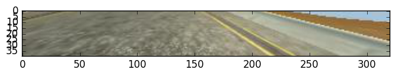

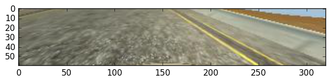

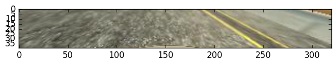

I should pause here to address the issue of why we are only
using the center camera.  After all, the training data do
provide two additional camera images: the left and right
cameras.  Surely, those provide additional useful information
that the model potentially could make use of.  However, in my
opinion there is a serious problem in using these data: the
simulator seems only to send to the network server in
`drive.py` the center image.  I really do not understand why
this is the case, since obviously the simulator is fully-capable
of scribbling the extra camera outputs down when recording
training data.  

Now, I have observed considerable discussion on the Slack
channel for this course on the subject of using the additional
camera images (left and right) along with a corresponding shift
of the steering angles.  Frankly, I am skeptical about the merit
of this strategy and shall avoid this practice, evaluate the
outcome, and adopt it only if absolutely necessary.

We begin by conducting a very simple analysis of the target
labels, which again are steering angles in the interval [-1,
1].  In fact, as real-valued outputs it may be a stretch to call
them "labels" and this is not really a classification problem.
Nevertheless in the interest of time we will adopt the term.

    f = plt.figure()                   
    y1 = np.array([float(s[0]) for s in select(split(feed("data/driving_log_all.csv")),[3])])
    h = plt.hist(y1,bins=100)          # plot histogram
    s = plt.savefig("hist1.png", format='png', bbox_inches='tight')
    print("")
    pp.pprint(describe(y1)._asdict())  # print descriptive statistics

    >>>
    OrderedDict([('nobs', 8036),
                 ('minmax', (-0.94269539999999996, 1.0)),
                 ('mean', 0.0040696440648332506),
                 ('variance', 0.016599764281272529),
                 ('skewness', -0.1302892457752191),
                 ('kurtosis', 6.311554102057668)])

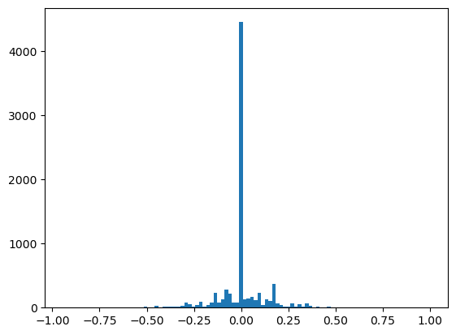

The data have non-zero *mean* and *skewness*, perhaps arising
from a bias toward left-hand turns when driving on a closed
track.

The data are dominated by small steering angles because the car
spends most of its time on the track in straightaways.  The
asymmetry in the data is more apparent if I mask out small
angles and repeat the analysis.  Steering angles occupy the
interval [-1, 1], but the "straight" samples appear to be within
the neighborhood [-0.01, 0.01].

We might consider masking out small angled samples from the
actual training data as well, a subject we shall return to in
the summary.

    f = plt.figure()
    p = lambda x: abs(x)<0.01
    y2 = np.array([s for s in filterfalse(p,y1)])
    h = plt.hist(y2,bins=100)
    s = plt.savefig("hist2.png", format='png', bbox_inches='tight')
    print("")
    pp.pprint(describe(y2)._asdict())

    >>> >>> >>>
    OrderedDict([('nobs', 3584),
                 ('minmax', (-0.94269539999999996, 1.0)),
                 ('mean', 0.0091718659514508933),
                 ('variance', 0.037178302717086116),
                 ('skewness', -0.16657825969015194),
                 ('kurtosis', 1.1768785967587378)])

>0.01 - No Reflection")

A simple trick we can play to remove this asymmetry&#x2014;if we
wish&#x2014;is to join the data with its reflection, effectively
doubling our sample size in the process.  For illustration
purposes only, we shall again mask out small angle samples.

    f = plt.figure()
    y3 = np.append(y2, -y2)
    h = plt.hist(y3,bins=100)
    s = plt.savefig("hist3.png", format='png', bbox_inches='tight')
    print("")
    pp.pprint(describe(y3)._asdict())

    >>> >>>
    OrderedDict([('nobs', 7168),
                 ('minmax', (-1.0, 1.0)),
                 ('mean', 0.0),
                 ('variance', 0.03725725015081123),
                 ('skewness', 0.0),
                 ('kurtosis', 1.1400026599654964)])

>0.01 - Full Reflection")

In one of the least-surprising outcomes of the year, after
performing the reflection and joining operations, the data now
are symmetrical, with mean and skewness identically 0.

Of course, in this analysis I have only reflected the target
labels.  If I apply this strategy to the training data,
naturally I need to reflect along their horizontal axes the
corresponding input images as well.  In fact, that is the
purpose of the `Xflip`, `yflip`, `rmap`, `rflip`, and `sflip`
utility functions described above.

It turns out there is another approach to dealing with the bias
and asymmetry in the training data.  In lieu of reflecting the
data, which by definition imposes a 0 mean and 0 skewness, we
can instead just randomly flip samples 50% of the time.  While
that will not yield a perfectly balanced and symmetric data
distribution, given enough samples it should give us a crude
approximation.  Moreover, it saves us from having to store more
images in memory, at the cost of some extra computation.
Essentially, we are making the classic space-time trade-off
between memory consumption and CPU usage.  

    y4 = [y for y in rmap(yflip, islice(cycle(y2), 2*y1.shape[0]))]  # 2 batches
    y5 = [y for y in rmap(yflip, islice(cycle(y2), 4*y1.shape[0]))]  # 4 batches
    y6 = [y for y in rmap(yflip, islice(cycle(y2), 8*y1.shape[0]))]  # 8 batches
    f = plt.figure()
    h = plt.hist(y4,bins=100)
    s = plt.savefig("hist5.png", format='png', bbox_inches='tight')
    f = plt.figure()
    h = plt.hist(y5,bins=100)
    s = plt.savefig("hist6.png", format='png', bbox_inches='tight')
    f = plt.figure()
    h = plt.hist(y6,bins=100)
    s = plt.savefig("hist7.png", format='png', bbox_inches='tight')
    print("")
    pp.pprint(describe(y4)._asdict())
    print("")
    pp.pprint(describe(y5)._asdict())
    print("")
    pp.pprint(describe(y6)._asdict())

    >>>
    OrderedDict([('nobs', 16072),
                 ('minmax', (-1.0, 1.0)),
                 ('mean', -0.00052772518417122953),
                 ('variance', 0.037283229390251714),
                 ('skewness', 0.008520498589019836),
                 ('kurtosis', 1.1769644267914074)])
    
    OrderedDict([('nobs', 32144),
                 ('minmax', (-1.0, 1.0)),
                 ('mean', -0.0022488201157292191),
                 ('variance', 0.037218482869856698),
                 ('skewness', -0.050201681486988635),
                 ('kurtosis', 1.1379036271452696)])
    
    OrderedDict([('nobs', 64288),
                 ('minmax', (-1.0, 1.0)),
                 ('mean', -0.00011066913374191124),
                 ('variance', 0.037250831344353398),
                 ('skewness', -0.01390556638239454),
                 ('kurtosis', 1.1406077506908527)])

Here, we see that as we increase the number of samples we draw
from the underlying data set, while randomly flipping them, the
mean tends to diminish.  The skewness does not behave quite so
well, though a coarser smoothing kernel (larger bin sizes for
the histograms) may help.  In any case, the following figures do
suggest that randomly flipping the data and drawing larger
sample sizes does help balance out the data.

>0.01 - Random Flipping, Recycle: 2")

>0.01 - Random Flipping, Recycle: 4")

>0.01 - Random Flipping, Recycle: 8")

The `sflip` utility function defined above flips not only the
target labels&#x2014;the steering angles&#x2014;but also the images (as it
must).  We check that by again displaying the 3 samples from
`driving_log_overtrain.csv` as above, but this time with each of
them flipped.

    X2 = [sflip(x) for x in X]
    f = plt.figure()                        
    plt.imshow(X2[0][0])                     
    f.suptitle("Angle: " + str(X2[0][1]))    
    s = plt.savefig("road7.png", format="png", bbox_inches='tight')
    f = plt.figure()
    plt.imshow(X2[1][0])
    f.suptitle("Angle: " + str(X2[1][1]))
    s = plt.savefig("road8.png", format="png", bbox_inches='tight')
    f = plt.figure()
    plt.imshow(X2[2][0])
    f.suptitle("Angle: " + str(X2[2][1]))
    s = plt.savefig("road9.png", format="png", bbox_inches='tight')

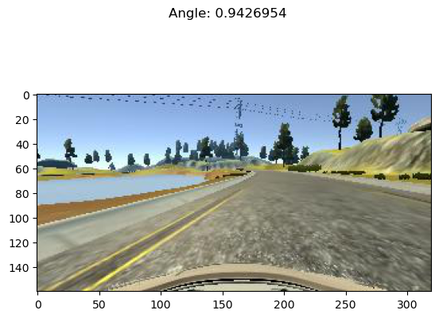

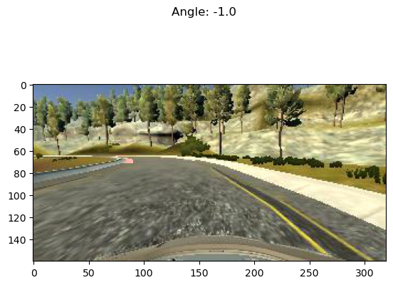

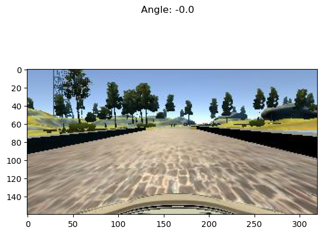

If we compare these 3 figures depicting the flipped samples from
the `driving_log_overtrain.csv` set, with the original unflipped
samples in the figures above we can confirm the expected
results.  The images are indeed horizontally-reflected mirror
images, and the corresponding steering angles indeed have their
signs flipped (though, trivially for the neutral-steering
case).  

After that grueling ordeal, and armed with these results, we now
can develop a strategy for presenting training data to the
model.

1.  Start with the Udacity data and see how far we can get.
2.  Split the data into training and validation files using
    command-line tools.
3.  Use `itertools` and custom utilities, leaning heavily on
    generator expressions.
4.  Take advantage of the small data sizes by keeping the
    original data in memory.
5.  But, perform a crude "augmentation" by randomly flipping the
    data horizontally (both images and steering angles) and
    recycling the base data.
6.  Consider cropping the data to reduce the input sizes, reduce
    memory usage, reduce the model size, and hopefully remove
    superfluous information.
7.  Use only the center-camera data and see how far we can get.

## Implementation

There are many approaches to selecting or developing a model.  The
one I took was to assume that there is wisdom and experience
already embedded in the Deep Learning models that already have
been developed in the autonomous-vehicle community.  I decided to
choose one of those models as a starting point, and then build off
of it or adapt it as needed.  There are many to choose from, but
two well-known and often-used ones are a [model](https://github.com/commaai/research/blob/master/train_steering_model.py) from [comma.ai](http://comma.ai/) and a
[model](https://images.nvidia.com/content/tegra/automotive/images/2016/solutions/pdf/end-to-end-dl-using-px.pdf) from [NVIDIA](https://www.nvidia.com/en-us/deep-learning-ai/developer/?ncid%3Dpa-pai-cs27dl-4165&gclid%3DCM37n4LQ0dECFUWVfgodzMsIZw).  I even considered adapting Yann LeCun's [MNIST
model](http://yann.lecun.com/exdb/mnist/) for recognizing hand-written digits and even my own
TensorFlow model for Traffic-Sign classification.  In the end, I
chose the NVIDIA model, since it is relatively simple, it is
well-tested, and it reportedly produces good results.  

In general, I observe several salient facts about the NVIDIA
model.

-   It consists of 9 layers, including a normalization layer, 5
    convolutional layers, and 3 fully-connected layers.
-   The input image is split into YUV planes.
-   The normalization layer is non-trainable.
-   The 5 convolutional layers have 3 with a 2x2 stride and 5x5
    kernel and 2 non-strided with a 3x3 kernel.
-   The convolutional layers increase in depth of filters while
    decreasing the image size.
-   Following the convolutional layers is non-trainable flattening
    layer.
-   The flattening layer feeds into the sequence of 3
    fully-connected layers.
-   The fully-connected layers decrease in hidden-units.
-   The last fully-connected layer feeds into a single non-trainable
    node to produce real-valued output (steering angles).
-   This being essentially a regression problem rather than a
    classification problem, the model does not terminate with a
    [sigmoid](https://en.wikipedia.org/wiki/Sigmoid_function) activation function and/or [softmax](https://en.wikipedia.org/wiki/Softmax_function) function and does not
    employ [one-hot encoding](https://en.wikipedia.org/wiki/One-hot).
-   While presumably they use activation functions within their
    network, the NVIDIA researches do not seem to specify which
    activation function(s) they use.
-   Likewise, they seem not to use [pooling](https://en.wikipedia.org/wiki/Convolutional_neural_network#Pooling_layer) layers or [dropout](https://en.wikipedia.org/wiki/Convolutional_neural_network#Dropout)
          layers.

In addition to their model architecture the NVIDIA researchers
also discuss augmentation and training.  

-   They augment their data by adding artificial shifts and
    rotations.
-   They transform their training data to account for the human
    drivers' possible departure from what they call the "ground
    truth", which is the road's centerline.
-   They train their model by minimizing the mean squared error
    ("mse") between the steering command output by the network and
    the command in the target data.  These correspond to our
    steering angles.

Finally, I observe some aspects of the comma.ai model, by way of
comparing and contrasting with the NVIDIA model.

-   The model uses the ELU [activation function](https://en.wikipedia.org/wiki/Activation_function) in its layers.
-   The model normalizes the data like the NVIDIA model does, but it
    is obvious that the data are normalized so that each of the RGB
    pixel values in [0,255] is scaled to real-valued numbers in
    [-1.0, 1.0].
-   The comma.ai researchers use the [ADAM](https://keras.io/optimizers/#adam) optimizer, a nice
    general-purpose optimizer with good performance and which does
    not require the specification of learning-rate parameters.
-   They also optimize the mse.

Synthesizing some of these concepts, I experimented with a family
of models that all had these general properties.

-   stacks of scaling, convolutional, flattening, fully-connected,
    and readout layers
-   start with a non-trainable normalization layer that scales the
    input so that each pixel color channel is in [-1.0, 1.0].
-   no sigmoid, softmax, or one-hot encoding
-   use either ELU or RELU activation functions
-   consider adding pooling and dropout layers
-   optimize mse using the ADAM optimizer so that at least I do not
    have to worry about learning rate parameters

Of note, I also have these departures from the aforementioned
architectures.

-   experiment with different cropping sizes and strategies
-   add a layer or layers (non-trainable) to do the cropping right
    in the model
-   experiment with adding a layer or layers (non-trainable) to
    reduce the image size before feeding the data into the trainable
    convolutional layers
-   experiment with a non-trainable readout layer using the [tanh](https://en.wikipedia.org/wiki/Activation_function)
    activation function to constrain the output to [-1, 1],
    appropriate for our steering angles
-   little or no augmentation, though the cropping and especially
    the image flipping (if used) might be considered augmentation of
    a sort
-   no manual transformation of the training data to a "ground
    truth" like the NVIDIA researchers did
-   the images are encoded in RGB planes rather than YUV planes
    unless it becomes necessary to do so
-   we add a non-trainable [AveragePooling2D](https://keras.io/layers/pooling/) layer to act as an image
    resizer.

With all of these considerations in mind, I conducted many
experiments with different combinations of factors, a saga that I
will not recount here.  In the end, the model that I settled on
had these features.

-   non-trainable cropping, resizing, and normalization layers
-   alternating convolutional and max-pooling layers
-   one dropout layer after the convolutional/max-pooling layers and
    before the flattening layer
-   fully-connected layers
-   non-trainable readout layer with no activation
-   RELU activations rather than ELU activations

Finally, I should add that for image augmentation I briefly
considered performing random shifts of the input data, but in the
end decided that it was not necessary.

### Model

The actual model is laid out in Keras code below.  It is coded
as a function that returns a Keras `model`.  Note that the
function does take the `input_shape` and the `crop_shape`.
Though I could perform image resizing (such as with
`cv2.resize`) and cropping outside of the model, I actually do
them inside the model.  This has several advantages.

1.  It simplifies the code.
2.  Whatever cropping/resizing occurs *must* also be done in the
    network service.  Performing these operations with the model
    means that this is handled automatically, for free.
3.  In general, we might realize better training performance as
    the cropping/resizing occur in the GPUs rather than in the
    CPU.  In my particular case this did not occur because I
    trained only on a laptop without a GPU.

This means that the `input_shape` is not really a
hyper-parameter, since it is just the original image size, which
as we already have seen is (160, 320, 3).  The `crop_shape`
still is a hyper-parameter, of course.

    def CarND(input_shape, crop_shape):
        model = Sequential()
    
        # Crop
        # model.add(Cropping2D(((80,20),(1,1)), input_shape=input_shape, name="Crop"))
        model.add(Cropping2D(crop_shape, input_shape=input_shape, name="Crop"))
    
        # Resize
        model.add(AveragePooling2D(pool_size=(1,4), name="Resize", trainable=False))
    
        # Normalize input.
        model.add(Lambda(lambda x: x/127.5 - 1., name="Normalize"))
    
        # Reduce dimensions through trainable convolution, activation, and
        # pooling layers.
        model.add(Convolution2D(24, 3, 3, subsample=(2,2), name="Convolution2D1", activation="relu"))
        model.add(MaxPooling2D(name="MaxPool1"))
        model.add(Convolution2D(36, 3, 3, subsample=(1,1), name="Convolution2D2", activation="relu"))
        model.add(MaxPooling2D(name="MaxPool2"))
        model.add(Convolution2D(48, 3, 3, subsample=(1,1), name="Convolution2D3", activation="relu"))
        model.add(MaxPooling2D(name="MaxPool3"))
    
        # Dropout for regularization
        model.add(Dropout(0.1, name="Dropout"))
    
        # Flatten input in a non-trainable layer before feeding into
        # fully-connected layers.
        model.add(Flatten(name="Flatten"))
    
        # Model steering through trainable layers comprising dense units
        # as ell as dropout units for regularization.
        model.add(Dense(100, activation="relu", name="FC2"))
        model.add(Dense(50, activation="relu", name="FC3"))
        model.add(Dense(10, activation="relu", name="FC4"))
    
        # Generate output (steering angles) with a single non-trainable
        # node.
        model.add(Dense(1, name="Readout", trainable=False))
        return model

Here is a summary of the actual model, as generated directly by
`model.summary` in Keras.

    ____________________________________________________________________________________________________
    Layer (type)                     Output Shape          Param #     Connected to                     
    ====================================================================================================
    Crop (Cropping2D)                (None, 60, 318, 3)    0           cropping2d_input_14[0][0]        
    ____________________________________________________________________________________________________
    Resize (AveragePooling2D)        (None, 60, 79, 3)     0           Crop[0][0]                       
    ____________________________________________________________________________________________________
    Normalize (Lambda)               (None, 60, 79, 3)     0           Resize[0][0]                     
    ____________________________________________________________________________________________________
    Convolution2D1 (Convolution2D)   (None, 29, 39, 24)    672         Normalize[0][0]                  
    ____________________________________________________________________________________________________
    MaxPool1 (MaxPooling2D)          (None, 14, 19, 24)    0           Convolution2D1[0][0]             
    ____________________________________________________________________________________________________
    Convolution2D2 (Convolution2D)   (None, 12, 17, 36)    7812        MaxPool1[0][0]                   
    ____________________________________________________________________________________________________
    MaxPool2 (MaxPooling2D)          (None, 6, 8, 36)      0           Convolution2D2[0][0]             
    ____________________________________________________________________________________________________
    Convolution2D3 (Convolution2D)   (None, 4, 6, 48)      15600       MaxPool2[0][0]                   
    ____________________________________________________________________________________________________
    MaxPool3 (MaxPooling2D)          (None, 2, 3, 48)      0           Convolution2D3[0][0]             
    ____________________________________________________________________________________________________
    Dropout (Dropout)                (None, 2, 3, 48)      0           MaxPool3[0][0]                   
    ____________________________________________________________________________________________________
    Flatten (Flatten)                (None, 288)           0           Dropout[0][0]                    
    ____________________________________________________________________________________________________
    FC2 (Dense)                      (None, 100)           28900       Flatten[0][0]                    
    ____________________________________________________________________________________________________
    FC3 (Dense)                      (None, 50)            5050        FC2[0][0]                        
    ____________________________________________________________________________________________________
    FC4 (Dense)                      (None, 10)            510         FC3[0][0]                        
    ____________________________________________________________________________________________________
    Readout (Dense)                  (None, 1)             0           FC4[0][0]                        
    ====================================================================================================
    Total params: 58,544
    Trainable params: 58,544
    Non-trainable params: 0
    ____________________________________________________________________________________________________

And, here is a visualization of the model, as provided by the
`plot` function in Keras.

    plot(CarND([160, 320, 3], ((80,20),(1,1))), to_file="model.png", show_shapes=True)

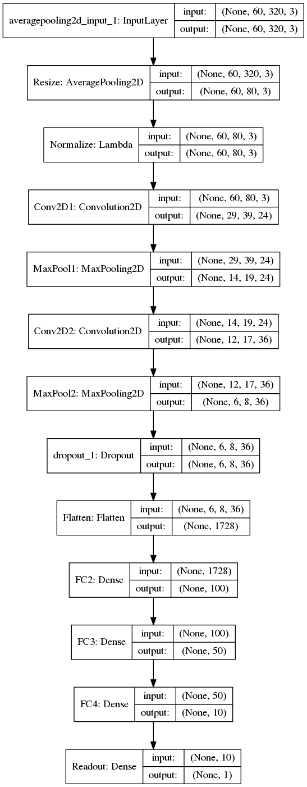

## Training

### Data Pipeline

The data-processing pipeline is rather simple, given the
composeable generator and non-generator utility functions
defined above.  The only real wrinkle is that we may want to do
random sample flipping (of both the image and its corresponding
steering angle) during training but we probably do not need to
do so for the validation data.  Since assembling the pipeline is
otherwise very similar for both the training and validation
data, and both should result in a generator that yields batches
consumable by the [`model.fit_generator`](https://keras.io/models/sequential/) function of Keras's
Sequential model, both pipelines are assembled in a function.

    def pipeline(theta, training=False):
        # randomly cycle through cached, loaded samples (images + angles)
        samples = select(rcycle(fetch(select(split(feed(theta.trainingfile)), [0,3]), theta.base_path)), [0,1])
        # for training we might do sample flipping but no need for validation
        if training:
            if theta.flip:
                samples = (sflip(x) for x in samples)
        # group the samples
        groups = group(samples, theta.batch_size)
        # turn the groups into batches (NumPy arrays)
        batches = batch(transpose(groups))
        # return the batch generator
        return batches

### Training

With functions for constructing the model architecture and the
data pipelines in hand, training is very simple.  One additional
item to point out is this.  There can be a proliferation of
*literal* hyper-parameters (crop sizes, epochs, batch sizes,
whether or not to do random flipping, etc.) and passing these
parameters among all the related and nested functions can be a
nuisance.  I find it convenient to collect such parameters into
a handy data structure that can be instantiated as a global
variable, and then all of the functions can access the
parameters that they need.  In Python, two obvious candidates
that leap to mind are [dictionaries](https://docs.python.org/3/tutorial/datastructures.html) and [classes](https://docs.python.org/3/tutorial/classes.html).  Python
dictionaries are slightly easier to create, but slightly more of
a nuisance to use, whereas the reverse is true for Python
classes/objects.  I elected to use an global instance `theta` of
a class `HyperParameters`, but this is not considered to be a
very important point.

Another point worth discussing relates to "cropping."  As
discussed above in the data analysis and architecture sections
and below in the summary, cropping of the data is an option that
I took.  The `theta.crop_shape` hyper-parameter that appears
below sets the cropping window, and it works as follows.

The `theta.crop_shape` parameter is dictated by the [Cropping2D](https://keras.io/layers/convolutional/#cropping2d)
layer to be a tuple of tuples.  The first tuple sets the number
of pixels to be cropped from the top and bottom edges along the
image height direction, and the second tuple sets the number of
pixels to be cropped from the left and right edges of the width
direction.  As you can see, the top and bottom are cropped with
`(80, 20)` which as in the figure above, removes much of the
image above the horizon and some of the image where the car hood
is superimposed.  Those values were chosen by experimentation,
and the choices are discussed below.  However, the `(1,1)` value
for the width cropping merits some explanation.  In principle, I
saw no reason to crop anything in the width direction.  However,
Keras has a bug (fixed but not yet in a stable release) such
that Cropping2D fails when any of the four elements in the tuple
of tuples is 0.  This is the reason for the 1 pixel crops on the
left and right edges.

Now, as a sanity check, we conduct a small training (3 epochs,
30 samples per epoch, batch size 10) of the data in
`driving_log_overtrain.csv`.  This is just to "get our feet wet"
and quickly to verify that the code written above even works.
Note that we use the same file for the validation set.  This is
just a test, so it does not really matter what we use for the
validation set.

    class HyperParameters:
        def __init__(self):
            return
    
    theta = HyperParameters()
    theta.input_shape = [160, 320, 3]
    theta.crop_shape = ((80,20),(1,1))   # crop size
    theta.samples_per_epoch = 30
    theta.valid_samples_per_epoch = 30
    theta.epochs = 3
    theta.batch_size = 10
    theta.trainingfile = "data/driving_log_overtrain.csv"
    theta.validationfile = "data/driving_log_overtrain.csv"
    theta.base_path = "data/"
    theta.flip = False
    
    model = CarND(theta.input_shape, theta.crop_shape)
    model.compile(loss="mse", optimizer="adam")
    
    traingen = pipeline(theta, training=True)
    validgen = pipeline(theta)
    
    print("")
    history = model.fit_generator(
        traingen,
        theta.samples_per_epoch,
        theta.epochs,
        validation_data=validgen,
        verbose=2,
        nb_val_samples=theta.valid_samples_per_epoch)

Next, we perform the actual training on the
`driving_log_train.csv` file, validating against the
`driving_log_validation.csv` file.  After *this* training we
actually save the model to `model.json` and the model weights to
`model.h5`, files suitable for input into the network service in
`drive.py`.  

    theta = HyperParameters()
    theta.input_shape = [160, 320, 3]
    theta.crop_shape = ((80,20),(1,1))
    theta.trainingfile = "data/driving_log_train.csv"
    theta.validationfile = "data/driving_log_validation.csv"
    theta.base_path = "data/"
    theta.samples_per_epoch = 7036
    theta.valid_samples_per_epoch = 1000
    theta.epochs = 3
    theta.batch_size = 100
    theta.flip = False
    
    model = CarND(theta.input_shape, theta.crop_shape)
    model.compile(loss="mse", optimizer="adam")
    
    traingen = pipeline(theta, training=True)
    validgen = pipeline(theta)
    
    print("")
    history = model.fit_generator(
        traingen,
        theta.samples_per_epoch,
        theta.epochs,
        validation_data=validgen,
        verbose=2,
        nb_val_samples=theta.valid_samples_per_epoch)
    model.save_weights("model.h5")
    with open("model.json", "w") as f:
        f.write(model.to_json())

    >>> >>> >>> >>> >>> >>> >>> >>> >>> >>> >>> >>> >>>
    ... ... ... ... ... ... Epoch 1/3
    139s - loss: 0.0132 - val_loss: 0.0126
    Epoch 2/3
    31s - loss: 0.0106 - val_loss: 0.0083
    Epoch 3/3
    27s - loss: 0.0099 - val_loss: 0.0092
    ... ... 4042

Ta-da!  We now have a trained model in `model.json` and
`model.h5` that we can run in the simulator with this command.

    python drive.py model.json

# Summary

This was an enjoyable and illuminating, albeit challenging project.
Ultimately, we believe we achieved the primary objectives of the
project.

-   The code is functional and successfully operates the simulator (on
    Track 1, at least).
-   The code is factored, organized, commented, and documented.
-   The code uses Python generators and the `model.fit_generator`
        function in Keras.
-   The training data are normalized.
-   The code uses a neural network that has convolutional layers.
-   There are activation layers (RELU) to introduce non-linearity into
    the model.
-   The data have been split into training and validation sets.  Note
    that no test data split was applied, since testing ultimately is
    done by successfully operating the car in the simulator.
-   The model has a dropout layer to help reduce overfitting.
-   No `tanh` activation function was needed in the final readout
    layer.
-   Training is done with the ADAM optimizer so that learning-rate
    parameters need not be fiddled with.
-   While we were prepared to record training data ourselves if
    necessary, in the end we succeeded using only the Udacity data.

Finally, we make the following observations.

-   After much experimentation, it turns out that cropping the image
    was the single most important factor in achieving good results.
-   From this observation we make the following inferences.
-   The "sky" portion of the image is largely irrelevant for
    generating appropriate steering angles.
-   In principle, the neural network could have learned that on its
    own, but helping it out by manually cropping out the sky was
    enormously helpful.
-   In fact, we actually cropped out more than just the sky, removing
    some of the road near the horizon.
-   When the road is curved, the portion of the road nearer to the
    horizon naturally has the greatest apparent curvature when
    projected onto the 2-D image plane.  Conversely, the curvature of
    the road near the car is barely apparent.
-   The portion of the road nearer to the horizon essentially provides
    information *about the future*.  That is, it establishes road
    conditions that the car *will* encounter.
-   The portion of the road nearer to the bottom essentially provides
    information *about the present*.  That is, it registers the
    position of the car left to right, with respect to the edges and
    centerline of the road.
-   This is a very simple neural network model, and we have
    made no effort whatsoever to introduce anything like "memory" or
    "anticipatory" behavior.
-   Our primary goal is *safely* to navigate the road by staying away
    from its edges.
-   Navigation (e.g., route planning) and choosing the best line
    (e.g., cutting the corners for racing purposes) are non-goals.
-   Consequently, it may very well be that the bottom 1/3 to 1/4 of
    the road really has the most relevance for the task at hand.
-   Cropping the image, and also resizing the image helped
    dramatically reduce the size of the model in terms of the number
    of parameters, which greatly helped training time.
-   Cropping and resizing right in the model, rather than as a
    pre-processing step, simplified the code and adapted it perfectly
    for the network service in `drive.py`.
-   Cropping the images ironically may have ameliorated the left-turn
    bias in the training data.
-   In earlier experiments, before cropping, there always was a
    pronounced leftward drift of the car unless image reflection or
    flipping was applied.
-   In those early experiments, image flipping thoroughly removed the
    leftward drift.
-   However, the car still had significant problems on sharp turns and
    *especially* with the "pit stop" after the bridge.
-   After adding the cropping of `(80,120)` for the top and bottom,
    the car was able to negotiate the sharp turns and avoid the pit
    stop.
-   Moreover, after adding the cropping the leftward drift largely
    disappeared *even without image flipping*.
-   We speculate that the influence of the left-turn bias is greatest
    within the upper portions of the image, but the model has no way
    of knowing that.
-   By cropping out much of the upper portions of the image we seem to
    have removed that bias.
-   Incidentally, the number of epochs was chosen largely by
    trial-and-error.  We ran experiments training with a large number
    of epochs, hoping to see the accuracy on the validation set turn
    around and start to diverge.  Unfortunately, we never saw that and
    the validation error continued to decline.
-   In principle, that should be good.  However, in practice, we
    noticed that models trained for many epochs, with very low
    validation accuracy, drove somewhat poorly.
-   We may not actually have needed the droput layer.  In fact, in
    some experiments we seem to have converged to a better-performing
    model more quickly *without* dropout.
-   It may be that without dropout, the model overtrains on Track 1,
    but that since we are validating on Track 1 it does not produce a
    problem.  If true then it is likely such an overtrained model
    without dropout would perform *more* poorly on other tracks.
-   For that reason, we kept the dropout layer.  We plan to perform
    more experiments and strive to achieve satisfactory performance on
    Track 2 after *only* training on Udacity's data for Track 1.
-   As discussed earlier, I had considered masking out small-angle
    samples.  However, I achieved satisfactory results without doing
    this.  It occurs to us that in fact these may be crucial data for
    stabilizing the car within the center of the track.
    
    One final thought is this.  In the end, the particular network
    architecture that I chose may be overkill.  It may be that a much
    simpler model would suffice.  As described earlier, I began with
    the NVIDIA model, which while simple still may be more than is
    needed here.  After all, that model drove a real car in real-world
    conditions, trained with real-world data.  Our problem confronts
    only a simulator.  Further work may involve drastically reducing
    the size and complexity of the model to see where it finally
    breaks down.
    
    <table border="2" cellspacing="0" cellpadding="6" rules="groups" frame="hsides">
    <caption class="t-above">Table 1: Final Model Characteristics</caption>
    
    <colgroup>
    <col  class="left" />
    
    <col  class="left" />
    </colgroup>
    <thead>
    <tr>
    <th scope="col" class="left">Hyper-Parameter</th>
    <th scope="col" class="left">Setting</th>
    </tr>
    </thead>
    
    <tbody>
    <tr>
    <td class="left">Data</td>
    <td class="left">Udacity data</td>
    </tr>
    
    
    <tr>
    <td class="left">Epochs</td>
    <td class="left">3</td>
    </tr>
    
    
    <tr>
    <td class="left">Samples per epoch</td>
    <td class="left">7036</td>
    </tr>
    
    
    <tr>
    <td class="left">Validation samples per epoch</td>
    <td class="left">1000</td>
    </tr>
    
    
    <tr>
    <td class="left">Batch size</td>
    <td class="left">100</td>
    </tr>
    
    
    <tr>
    <td class="left">Random sample flipping</td>
    <td class="left">no</td>
    </tr>
    
    
    <tr>
    <td class="left">Top crop</td>
    <td class="left">80 pixels</td>
    </tr>
    
    
    <tr>
    <td class="left">Bottom crop</td>
    <td class="left">20 pixels</td>
    </tr>
    
    
    <tr>
    <td class="left">RGB or YUV image encoding</td>
    <td class="left">RGB</td>
    </tr>
    
    
    <tr>
    <td class="left">Training time</td>
    <td class="left">under 2 minutes</td>
    </tr>
    
    
    <tr>
    <td class="left">Camera</td>
    <td class="left">center-only</td>
    </tr>
    
    
    <tr>
    <td class="left">Augmentation</td>
    <td class="left">none</td>
    </tr>
    </tbody>
    </table>
